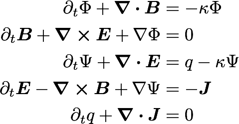
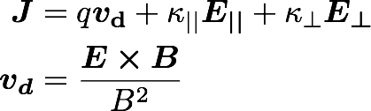

# AMRVACPHYS MODULES

This document describes the equations implemented in the
**src/EQUATION/amrvacphys.t** and **src/EQUATION/amrvacpar.t** files, and
gives tips on how a new module can be created. Information about LIBRARY and
USER defined source terms are in AMRVAC_Man/[amrvacusr](amrvacusr.html). In
principle, the code handles anything of generic form

The code is configured to use the specified equation with the setting

    
    
    $AMRVAC_DIR/setup.pl -p=EQUATION

where EQUATION is one of the implemented physics modules (hd,mhd,srmhd,...),
see below.

This page:  
[RHO] [NONLINEAR] [HDADIAB] [HD] [MHDISO] [MHD] [SRHD and SRHDEOS] [SRMHD and
SRMHDEOS] [SRRMHD] [FF] [Div B sources] [Positivity fixes] [New]

## Transport Equation: rho

    
    
    $AMRVAC_DIR/setup.pl -p=rho

The transport equation describes the transport of a scalar field, here the
density **rho** by a prescribed velocity field. This equation is used for test
purposes.

The **eqpar(v1_), eqpar(v2_), ...** equation parameters (there are as many as
there are dimensions NDIM) define the components of the uniform velocity
field.

For a linear scalar equation the Riemann solver is trivial, thus all TVD type
methods give identical results.

## Nonlinear scalar Equation: nonlinear

    
    
    $AMRVAC_DIR/setup.pl -p=nonlinear

The nonlinear scalar equation is either the inviscid Burgers equation, or the
non-convex equation, depending on the **eqpar(fluxtype_)** equation parameter
(1 for Burgers, 2 for nonconvex).

There is also a version coupling the nonlinear set with the advection
equation: **nonlinear+rho**. This was used to study basic coupling strategies.

## Adiabatic Hydrodynamics: hd

    
    
    $AMRVAC_DIR/setup.pl -p=hd -eos=iso

Includes the equations for pressureless dust and the Shallow Water equations

The system of adiabatic hydrodynamical equations are solved for the density
**rho** and the momentum density **m=rho*v**. The pressure is a function of
density only since an isentropic initial condition is assumed. There are two
equation parameters, the adiabatic index **eqpar(gamma_)** (the isothermal
case corresponds to **eqpar(gamma_)=1**) and the adiabatic constant
**eqpar(adiab_)** (which should be positive or zero). It is possible to set
**eqpar(adiab_)=0** and handle the case of pressureless dust.

The system of **shallow water equations** is a special case with the following
identifications: **rho=h** represents the height of the water column,
**eqpar(gamma_)=2** and the adiabatic coefficient is half of the gravitational
acceleration **eqpar(adiab_)=g/2**.

There is a Roe-type Riemann solver implemented, in _hd/roe.t_. Several
routines specific to HLLC are in _hd/hdhllc.t_.

## Hydrodynamics: hd

    
    
    $AMRVAC_DIR/setup.pl -p=hd -eos=gamma

The Euler equations are solved for density **rho**, the momentum density
**m=rho*v** and the total energy density **e**. The pressure is a derived
quantity which is calculated from the conservative variables.

There is a single equation parameter, the adiabatic index **eqpar(gamma_)**
(typical value is 5/3). The Riemann solver uses the Roe-average, and is
implemented in _hd/roe.t_. Several routines specific to HLLC are in
_hd/hdhllc.t_.

This equation module can be combined with the LIBRARY source definitions for
(local) optically thin radiative losses, see
AMRVAC_Man/[mpiamrvac_radcool.html](mpiamrvac_radcool.html). Schematically, it
introduces terms as

In this case two scaling parameters relate to temperature and the radiative
loss function, namely _eqpar(Tscale_)_ and _eqpar(Lscale_)_.

The HD module can also be combined with the external gravity modules, either
for uniform gravity (_amrvacusr.gravity.t_) or for point gravity, see
AMRVAC_Man/[mpiamrvac_pointgrav.html](mpiamrvac_pointgrav.html). These are

and for point gravity

Note how the gravitational constant and the non-dimensionalization is taken
into the parameters _M_point_ and its location _x_point_.

## Isothermal Magnetohydrodynamics: mhd

    
    
    $AMRVAC_DIR/setup.pl -p=mhd -eos=iso_

This is the system of the MHD equations without the full energy equation, and
with the following conservative variables: density **rho**, momentum density
**m=rho*v**, and the magnetic field **B**. The magnetic field is measured in
units for which the magnetic permeability is 1. The density pressure relation
is polytropic.

The source terms on the right hand side with **eta** in them are the resistive
terms.

There are three equation parameters: the polytropic index **eqpar(gamma_)**
(which must be larger or equal to 1), and the resistivity **eqpar(eta_)**, and
the entropy **eqpar(adiab_)**. Ideal MHD corresponds to **eqpar(eta_)=0**,
positive values give a uniform resistivity, while a negative value calls the
**specialeta** procedure in the [ AMRVACUSR
module](amrvacusr.html#Specialsource) to determine the resistivity as a
function of the coordinates, of the conservative variables, and/or of the
current density. This subroutine is to be completed by the user.

## Magnetohydrodynamics: mhd

    
    
    $AMRVAC_DIR/setup.pl -p=mhd -eos=gamma

This is the full system of the MHD equations, with the following conservative
variables: density **rho**, momentum density **m=rho*v**, total energy density
**e** and the magnetic field **B**. The magnetic field is measured in units
for which the magnetic permeability is 1.

The source terms on the right hand side with **eta** in them are the resistive
terms.

There are two equation parameters: the adiabatic index **eqpar(gamma_)**
(which must be strictly positive and different from 1), and the resistivity
**eqpar(eta_)**. Ideal MHD corresponds to **eqpar(eta_)=0**, positive values
give a uniform resistivity, while a negative value calls the **specialeta**
procedure in the [ AMRVACUSR module](amrvacusr.html#Specialsource) to
determine the resistivity as a function of the coordinates, of the
conservative variables, and/or of the current density. This subroutine is to
be completed by the user.

There is a Roe-type Riemann solver implemented using arithmetic averaging, in
_mhd/roe.t_, while several routines specific to HLLC are in _mhd/mhdhllc.t_.

This equation module can be combined with the LIBRARY source definitions for
(local) optically thin radiative losses, see
AMRVAC_Man/[mpiamrvac_radcool.html](mpiamrvac_radcool.html). It can also be
combined with the external gravity modules, either for uniform gravity
(_amrvacusr.gravity.t_) or for point gravity, see
AMRVAC_Man/[mpiamrvac_pointgrav.html](mpiamrvac_pointgrav.html).

We also have implemented the splitting strategy, where a static, potential
background field is assumed. This modifies the equations and brings in extra
sources and flux terms.

## Special Relativistic Hydro: srhd(eos)

    
    
    $AMRVAC_DIR/setup.pl -p=srhd
    
    
    or
    
    
    $AMRVAC_DIR/setup.pl -p=srhdeos

This equation module has to deal with the non-trivial relation between
primitive variables and conservative variables. Therefore, two auxiliary
variables are taken along, which are the Lorentz factor and the pressure. The
transformation from primitive to conservative also depends on the actual
equation of state assumed. The _srhd_ module assumes an ideal gas with
constant adiabatic index, the _srhdeos_ builds in the Mathews EOS. These are

It is straightforward to generalize the EOS used, by suitably modifying only
subroutines in the _srhdeos/srhdeos.t_ module.

## Special relativistic ideal MHD: srmhd

    
    
    $AMRVAC_DIR/setup.pl -p=srmhd -eos=gamma/synge/iso

This equation module has to deal with the non-trivial relation between
primitive variables and conservative variables. Therefore, two auxiliary
variables are taken along, which are the Lorentz factor and the _ksi_
variable. The transformation from primitive to conservative also depends on
the actual equation of state assumed. Several equations of state are
implemented: Ideal gas (_$AMRVAC_DIR/setup.pl -eos=gamma_), approximate Synge
gas (_$AMRVAC_DIR/setup.pl -eos=synge_) and isentropic flow
(_$AMRVAC_DIR/setup.pl -eos=iso_).

It is straightforward to generalize the EOS used, by suitably modifying only
the _srmhd/eos.t_ module.

## Special relativistic resistive MHD: srrmhd

    
    
    $AMRVAC_DIR/setup.pl -p=srrmhd -eos=gamma/synge

The implemented algorithm is adopted from [Komissarov
(2007)](http://adsabs.harvard.edu/abs/2007MNRAS.382..995K) and evolves both
magnetic and electric fields. A GLM treatment to constrain the divergences of
B and E is used.

Two constraint equations are evolved, for variables psi_ and phib_. As in the
SRMHD case, two axiliary variables lfac_ and xi_ are used for the conversion
between conserved and primitive variables. Current is given by the Ohm's law:

  
which is simply J=1/eta E in the fluid frame. The quantities in the fluxes
read

Resistivity is controlled with the parameter _eqpar(eta_)_. The speed of
monopole-dampening is adjusted with _eqpar(kappa_)_. We recommend setting the
timestep-parameter _dtdiffpar_ to a value of around 0.1 for numerical
stability. This adjusts the timestep taken for the potentially stiff part of
the sources. The SRRMHD module can be combined with the Synge EOS and the
gamma-law. So far the implementation is only for cartesian grids.
Generalisation to spherical and cylindrical grids is straight-forward though
and should just implement the subroutine _addgeometry_. A further caveat is
that the implementation requires three vector components, e.g. _-d=13, -d=23
or -d=33_. Finally, please run the code with _ssplitresis = .true._ to allow
operator splitting of a part of the sources.

As the equation for the electric field becomes stiff for small resistivities,
the time-step can become prohibitively small for eta_<1e-3. This is typically
tackled with a mixed implicit-explicit timestepping scheme as for example by
[Palenzuela et al. (2009)](http://adsabs.harvard.edu/abs/2009MNRAS.394.1727P).
Implementing the IMEX scheme would be the next step allowing to simulate high
Lundquist-numbers and resolve the tearing instability in a more economic way.

## "Force Free", Maxwells equations with Ohm's law: ff

    
    
    $AMRVAC_DIR/setup.pl -p=ff -eos=iso

The implemented equations are discussed in [Komissarov, Barkov and Lyutikov
(2007)](http://adsabs.harvard.edu/abs/2007MNRAS.374..415K). This can be
understood as a simplification of the SRRMHD physics module. Again, a GLM
treatment to constrain the divergences of B and E is used.

The current is composed of drift-current and conductivity current:

where vd is the drift-velocity, and the conductivity is split in components
parallel and perpendicular to the magnetic field via _eqpar(kpar_)_ and
_eqpar(kperp_)_. Dampening of the divergence errors is controlled via
_eqpar(kappa_)_. So far this is implemented only for cartesian grids.
Generalisation to spherical and cylindrical grids is straight-forward though
and should just implement the subroutine _addgeometry_. The implementation
requires three vector components, e.g. _-d=13, -d=23 or -d=33_. For
convenience, the subroutine _getcurrent()_ will return the current according
to the previous definition.

Note that the timestep for the stiff source addition requires _dt &lt;
dtdiffpar / max(eqpar(kpar_),eqpar(kperp_))_ which can become costly for
conductivities larger than 1000.

## Divergence B source treatments

Both the classical and the special relativistic MHD module can deal with
solneoidal magnetic field corrections through source term treatments.
Traditionally, these can be written as

Terms proportional to **div B** are [Powell's fix](methods.html#Powell's) for
the numerical problems related to the divergence of the magnetic field. They
are used only in more than 1D. For relativistic MHD (and/or for classical), we
just take the term along in the induction equation, known as Janhunen's
approach. Another option is to use the diffusive (parabolic) approach, with
the parameter _C_d_ of order unity (up to 2). Alternatively, there are several
versions of [Dedner's](methods.html#Dedner's) generalised Lagrange multiplier
(GLM).

## Positivity fixes

Another, similarly corrective, action is referred to as positivity fixing.
This is merely an additional means to handle the supposedly rare instances
where due to all nonlinearities of the scheme employed, the local conservative
to primitive transformation signals a non-physical state. Our positivity fix
approach can then be activated, and one such strategy operates as follows:
identify all cells (within the same grid block) that represent physical states
surrounding a faulty cell in a rectangular zone up to _nflatgetaux_ cells
away; (2) convert those cells to primitive variables; and (3) for all but the
magnetic field components, replace the faulty cell values by the average of
surrounding physical state cells. Finally, revert to conservative variables
where needed. Obviously, in this form, strict conservation may be violated.
These fix strategies are seperated off in the _EQUATION/correctaux.t_ modules.
They are by default inactive, and can be controlled by the parameters
**strictgetaux**, **strictsmall** and other related parameters described in
[par/PROBLEM](par.html#Methodlist).

## Creating a New VACPHYS Module

A new physics module should be created when the equations to be solved differ
significantly from the equations already implemented. If the difference can be
described by source terms (e.g. heat conduction, viscosity, radiative cooling,
external gravitational field etc.), the
[specialsource](amrvacusr.html#Specialsource) subroutine of the AMRVACUSR
module should be used instead of writing a new AMRVACPHYS module.

A new AMRVACPHYS module may be created gradually. The first step is to create
a new folder **src/NEWEQ** with the files **amrvacphys.t** and
**amrvacpar.t**. You best copy and edit an existing AMRVACPHYS module similar
to the new one. The idea is that some functionality (like any solver which
requires more info than a maximal physical propagation speed, i.e. anything
beyond TVDLF) should only be added at a later stage. In principle, the needed
subroutines are at the minimum

    
    
    subroutine conserve          (define the primitive to conservative transformation)
    subroutine primitive         (define the conservative to primitive transformation)
    subroutine getv              (define the advection speed, to be seen in combination with getflux)
    subroutine getcmax           (return the (minimal and) maximal physical propagation speed)
    subroutine getflux           (define the physical fluxes for all variables)
    subroutine getfluxforhllc    (idem as above, with slightly different call interface)
    subroutine addgeometry       (in case other than cartesian cases are needed: geometrical source additions)
    

If your equations contain more restrictions on the time step than the CFL
condition, the **getdt** subroutine could be written (it is otherwise included
from the _amrvacnul/getdt.t_. For axial symmetry **addgeometry** should
provide the _geometrical_ source terms, while other source terms may be given
in **addsource**, with interface.

At this point you can use the TVDLF scheme, without any constraint. To make
the other TVD type schemes work the subroutines in the **amrvacnul/roe.t**
file should be specified, and this is not a trivial task. It is probably best
to study the existing Riemann solvers to get an idea what is required.

If you think that your new AMRVACPHYS module is of general interest, please
send it to the developers, so we may actually make it part of the future
release.

