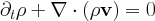
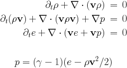
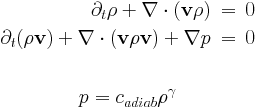

# Physics modules and equations

[TOC]

# List of physics modules {#eq_list_physics}

This document describes the equations implemented.
Information about user defined source terms are in [user module](amrvacusr.md). In
principle, the code handles anything of generic form

The code is configured to use the specified set of equations by activating it in 
the usr_init subroutine of user module "mod_usr.t"

    subroutine usr_init()
      ...
      call EQUATION_activate()
    end subroutine usr_init

where EQUATION is one of the implemented physics modules (rho,hd,mhd),
see below.

## Transport Equation: rho {#eq_rho}

    call rho_activate()

The transport equation describes the transport of a scalar field, here the
density **rho** by a prescribed velocity field. This equation is used for test
purposes.

The parameters rho_v in the rho_list of amrvac.par file
 define the components of the uniform velocity field.

For a linear scalar equation the Riemann solver is trivial, thus all TVD type
methods give identical results.

## Scalar Nonlinear Equation: nonlinear {#eq_nonlinear}

    call nonlinear_activate()

This module contains various instances of a scalar nonlinear equation, including the inviscid Burgers, inviscid nonconvex equation, as well as a possibility to handle the Korteweg-de Vries equation. It allows testing of truly nonlinear (shock steepening and formation) phenomena, in 1D to multi-D, or to test how source additions are best combined with flux prescriptions and discretizations. The equation implemented in \f$N_d\f$ dimensions is

    \f$  \frac{\partial \rho}{\partial t} + \nabla \cdot \mathbf{F}(\rho,\mathbf{x},t) = -\delta^2 \sum_{i=1}^{N_d} \frac{\partial^3 \rho}{\partial x_i^3} \f$

where the RHS is activated through the _mod_kdv.t_ module. The actual flux expression can be chosen (depending on the parameter `nonlinear_flux_type`) to be one of
\f$   \mathbf{F}^{\mathrm{burgers}}  =  \frac{1}{2}{\rho^2}\mathbf{v}_0  \f$ or
\f$  \mathbf{F}^{\mathrm{nonconvex}}  =  {\rho^3}\mathbf{v}_0 \f$
where we introduced \f$\mathbf{v}_0=\sum_{i=1}^{N_d} \hat{\mathbf{e}}_i\f$

## Hydrodynamics: hd {#eq_hd}

    call hd_activate()

The Euler equations are solved for density **rho**, the momentum density
**m=rho*v** and the total energy density **e**. The pressure is a derived
quantity which is calculated from the conservative variables.

Parameters of hydrodynamics are read in the **hd_list** of parameter file.
There is a single equation parameter, the adiabatic index **hd_gamma**
(typical value is 5/3). 

This equation module can be combined with physical sources for
(local) optically thin radiative losses by set **hd_radiative_cooling=.true.**. 
see the [radiative cooling](radiative_cooling.md) page. Schematically, it
introduces terms as

The HD module can also be combined with the external gravity module 
(_src/physics/mod_gravity.t_) for uniform gravity by set **hd_gravity=.true.**

and for point gravity

Note how the gravitational constant and the non-dimensionalization is taken
into the parameters _M_point_ and its location _x_point_.

To do adiabatic hydrodynamics (i.e. solve the hydro set without energy equation added) just add in hd_list of parameter file

    hd_energy=.false.

This special case includes the equations for pressureless dust and the Shallow Water equations, and writes generally as

The system of adiabatic hydrodynamical equations are solved for the density
**rho** and the momentum density **m=rho*v**. The pressure is a function of
density only since an isentropic initial condition is assumed. There are two
equation parameters, the adiabatic index **hd_gamma** (the isothermal
case corresponds to **hd_gamma**) and the adiabatic constant
**hd_adiab** (which should be positive or zero). It is possible to set
**hd_adiab=0** and handle the case of pressureless dust.

The system of **shallow water equations** is a special case with the following
identifications: **rho=h** represents the height of the water column,
**hd_gamma2** and the adiabatic coefficient is half of the gravitational
acceleration **hd_adiab=g/2**.

There is a Roe-type Riemann solver implemented, in _hd/mod_hd_roe.t_. Several
routines specific to HLLC are in _hd/mod_hd_hllc.t_.

## Magnetohydrodynamics: mhd {#eq_mhd}

    call mhd_activate()

This is the full system of the MHD equations, with the following conservative
variables: density **rho**, momentum density **m=rho*v**, total energy density
**e** and the magnetic field **B**. The magnetic field is measured in units
for which the magnetic permeability is 1.

Parameters of magnetohydrodynamics are read in the **mhd_list** of parameter file.
The source terms on the right hand side with **eta** in them are the resistive
terms.

There are three equation parameters: the polytropic index **mhd_gamma**
(which must be larger or equal to 1), and the resistivity **mhd_eta**, and
the entropy **mhd_adiab**. Ideal MHD corresponds to **mhd_eta=0**,
positive values give a uniform resistivity, while a negative value calls the
**specialeta** procedure to determine the resistivity as a
function of the coordinates, of the conservative variables, and/or of the
current density. This subroutine is to be completed by the user.

There is a Roe-type Riemann solver implemented using arithmetic averaging, in
_mhd/mod_mhd_roe.t_, while several routines specific to HLLC are in _mhd/mod_mhd_hllc.t_.

This equation module can be combined with physical sources for
(local) optically thin [radiative losses](radiative_cooling.md) by set **mhd_radiative_cooling=.true.**. 
It can also be combined with the external gravity modules by set **mhd_gravity=.true.**.

We also have implemented the magnetic field splitting strategy, where a static, 
background magnetic field is assumed. This modifies the equations and brings in extra
sources and flux terms.

To run isothermal magnetohydrodynamics, add in mhd_list of parameter file

    mhd_energy=.false.

This is the system of the MHD equations without the full energy equation, and
with the following conservative variables: density **rho**, momentum density
**m=rho*v**, and the magnetic field **B**. The magnetic field is measured in
units for which the magnetic permeability is 1. The density pressure relation
is polytropic.

# Divergence B source treatments {#eq_divB_fix}

Both the classical and the special relativistic MHD module can deal with
solenoidal magnetic field corrections through source term treatments.
Traditionally, these can be written as

Terms proportional to **div B** are [Powell`s fix](methods.md) for
the numerical problems related to the divergence of the magnetic field. They
are used only in more than 1D. We can also
just take the term along in the induction equation, known as Janhunen`s
approach. Another option is to use the diffusive (parabolic) approach, with
the parameter _C_d_ of order unity (up to 2). Alternatively, there is the 
[Dedner`s](methods.md) generalised Lagrange multiplier (GLM) method.

# Positivity fixes {#eq_positivity_fixes}

Another, similarly corrective, action is referred to as positivity fixing.
This is merely an additional means to handle the supposedly rare instances
where due to all nonlinearities of the scheme employed, the local conservative
to primitive transformation signals a non-physical state. Our positivity fix
approach can then be activated, and one such strategy operates as follows:
identify all cells (within the same grid block) that represent physical states
surrounding a faulty cell in a rectangular zone up to **small_values_daverage** cells
away; (2) convert those cells to primitive variables; and (3) for all but the
magnetic field components, replace the faulty cell values by the average of
surrounding physical state cells. Finally, revert to conservative variables
where needed. Obviously, in this form, strict conservation may be violated.
These fix strategies are seperated off in the _mod_small_values_ modules.
They are by default inactive, and can be controlled by the parameters
**small_values_method** and other related parameters described in
[par/PROBLEM](par.md).
