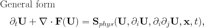

# Features overview

[TOC]

This is a brief overview of the main features of the MPI-AMRVAC software
package.

# Structure {#feat-structure}

This software has to be configured, preprocessed, and compiled into a single
main executable program, **amrvac** which can be run on multiple processors
using MPI. MPI-AMRVAC will initialize and advance the unknowns, and perform
automated grid refinement to follow all details of the (possibly shock-dominated) flow. 
The program is split into several logical parts, and heavily
uses Fortran 90 modules and dynamic allocation.

Once the configuration and compilation are done, **amrvac** can advance the
solution in time, or can be used to convert previously produced data files to
specific other formats for visualization. The data itself will be saved into
`.dat` data files, which each contain a single snapshot of all grids and their
unknowns in time, which can be used for eventual restarts. Besides these
snapshots, the code can write output in a number of formats, which can directly
be visualized with e.g. Paraview or Visit.

# Source Language and Compilation {#feat-source}

The `*.t` source files of AMRVAC are written in [dimension independent notation](source.md), known as the _LASY_ syntax. A suitably modified (and
also simplified) version of the VAC Pre-Processor, [VACPP](vacpp.md)
translates the source code files to Fortran 90.

# Equations {#feat-eqns}

In general, MPI-AMRVAC aims to solve a system of (primarily hyperbolic)
partial differential equations written in conservation form, with optional
source terms on the right hand side:

See [equations](equations.md) for more detail.

# Grid and Boundary {#feat-grid}

The following types of finite-volume grids are supported:

* Cartesian 1D, 1.5D, 2D, 2.5D, 3D
* Cylindrical 2D, 2.5D, 3D
* Polar 2D, 2.5D, 3D
* Spherical 2D, 2.5D, 3D

The **slab**, **cylindrical** or **spherical** grids differ in the definition
of volumes and surfaces for the grid cells, and there are some extra terms in
the equations, like the p/r term in the radial momentum equation for
hydrodynamics. These are defined in the **addgeometry** subroutines for each
AMRVACPHYS module. For polar grids the same geometrical source terms are used.

The boundaries are represented by ghost cells around the physical mesh. Of
course, for a grid-adaptive computation, internal boundaries are handled
appropriately, and the user is expected to interfere only with the physical
domain boundaries, which represent 2, 4, or 6 regions depending on the
dimensionality (1,2 or 3). The boundary types are defined for each region and
each variable separately. The following boundary types are available:

Type | Value of the ghost cell
---|---
periodic | Copied from opposite edge of the mesh
symm | Reflected from closeby mesh cells
asymm | Reflected from closeby cells and multiplied by -1
cont | Copied from mesh cell next to the ghost cell
special | Defined by the specialbound subroutine in AMRVACUSR module

The pages on [discretization](discretization.md) and
[axial coordinates](axial.md) provide further information.

# Spatial Discretization {#feat-spatial}

In MPI-AMRVAC, most discretizations are shock capturing conservative numerical
schemes. A non exhaustive list is given by:

Name | Description
---|---
cd4 | 4th order central difference scheme
tvdlf | MUSCL type TVD-Lax-Friedrich
tvdmu | TVD-MUSCL with Hancock predictor
tvd | One-step temporally 2nd order TVD
hll | Harten-Lax-van Leer (HLL) solver
hllc| Harten-Lax-van Leer-Contact (HLLC) solver
hlld| Harten-Lax-van Leer-Discontinuities (HLLD) solver
fd | conservative finite differences, up to fifth order with MP5 reconstruction

In multidimensional MHD calculations the divergence of the magnetic field may
become significantly different from zero. This may cause numerical instability
or inaccurate results. There are several source-term options to fix this
problem. E.g., Powell non-conservative source terms, which are
proportional to div B, can be used to stabilize, and to improve the
accuracy for any of the methods. We also provide several variants of the
Dedner GLM scheme.

See [methods](methods.md) for a more detailed description.

# Temporal Discretization {#feat-temporal}

With the finite volume methods, second order accurate explicit time
integration can be obtained by predictor-corrector and multistep Runge-Kutta
type discretizations. See [time_discretization](time_discretization.md). In finite differences, the overall accuracy can go up to
fourth order using the appropriate temporal discretizations. The more
important ones are:

Name | Description
---|---
onestep | 1st order Euler scheme
twostep | 2nd order predictor-corrector schemes
threestep | 3rd order (TVD) Runge-Kutta
fourstep | rk4 allows for selecting 4th order Runge-Kutta (classical)
fourstep | ssprk4 is a 3rd order, strong stability preserving four step Runge-Kutta
fivestep | ssprk5 is 4th order, strong stability preserving five step Runge-Kutta

The time step can be adjusted dynamically to satisfy the stability criteria.
