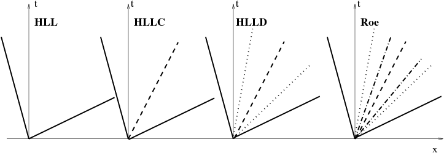

# Numerical methods

This document briefly describes the features of the spatial discretizations
available in MPI-AMRVAC. The different options can be set in the
[methodlist](@ref par_methodlist) of the input par file. For a more
extensive description, you can read the article [Comparison of some FCT and
TVD Schemes](http://www-personal.umich.edu/~gtoth/Papers/vac.html). Also, the
paper using MPI-AMRVAC has info on the various methods, see 'Parallel, grid-
adaptive approaches for relativistic hydro and magnetohydrodynamics', R.
Keppens, Z. Meliani, A.J. van Marle, P. Delmont, A. Vlasis, &amp; B. van der
Holst, 2011, JCP. [doi:10.1016/j.jcp.2011.01.020](http://dx.doi.org/10.1016/j.jcp.2011.01.020).
A more recent update is 'MPI-AMRVAC FOR SOLAR AND ASTROPHYSICS', O. Porth, C.
Xia, T. Hendrix, S. P. Moschou and R. Keppens ApJS.
[doi:10.1088/0067-0049/214/1/4](http://dx.doi.org/10.1088/0067-0049/214/1/4).

The acronyms TVD, TVDLF, and TVD-MUSCL stand for Total Variation Diminishing,
TVD Lax-Friedrich, and TVD Monotonic Upwind Scheme for Conservation Laws,
respectively. Then, depending on the physics module selected, you also have
HLL, HLLC, and HLLD schemes, which are due to harten Lax, van Leer, with the HLLC
variant including a treatment for the Contact discontinuity, as e.g. described
for Euler gas dynamics in _E.F. Toro, Riemann solvers and numerical methods
for fluid dynamics (Berlin, Springer-Verlag, 1997)_, and with the HLLD variant
for MHD including multiple discontinuities, which was invented by Miyoshi and
Kusano in _Journal of Computational Physics, 208, 315-344 (2005)_.

Not all methods are available or meaningfull for all physics modules. In fact,
we have the following combinations typically:

    Physics   Schemes
    --------------------------------------------------------------------------
    rho       TVDLF, HLL, HLLC, TVD (Roe solver), TVDMU (Roe solver), FD
    HD        TVDLF, HLL, HLLC, TVD (Roe solver), TVDMU (Roe solver), FD
    MHD       TVDLF, HLL, HLLD, TVD (Roe solver), TVDMU (Roe solver), FD

Also, the method can be selected per AMR grid level, but one can not combine
different stepsize methods (hence, TVD is the only second order onestep
method, while all others can be used with all steps time stepper/integrator
setting). In MPI-AMRVAC, the **flux_scheme** is thus an array of strings, one
string per level up to **nlevelshi**. Some more info follows on the various
methods.

## HLL HLLC and HLLD schemes

The TVDLF scheme hence uses minimal info on the wave speeds, and in
combination with AMR and its inherent robustness due to its diffusive nature,
it is readily usable for any system of conservation laws at minimal
implementation costs. But TVDLF maybe too diffusive to resolve details in
your applications. Maximal wave speed info is used in a full Roe-type
approximate Riemann solver as employed by TVD or TVD-MUSCL, where all
characteristic wave speeds (7 in total for (relativistic) MHD) as well as the
wave strengths are deduced from the eigenvalues, as well as right and left
eigenvector pairs of the flux Jacobian. However,  TVD or TVD-MUSCL is limited
to second-order accuracy and not the most efficient one. The simpler HLL, 
HLLC, and HLLD solvers, make further approximations to their corresponding 
representation of the Riemann fan, as schematically illustrated below. 
In these approximate Riemann solvers, the HLL is available for all physics 
modules but the most diffusive one. The HLLC is designed for HD physics and
gives unreliable results for MHD. The HLLD works only for MHD and gives the
best resolution with higher efficiency than Roe solver. 

## TVDLF Scheme

The TVD Lax-Friedrich method is robust, in most cases there are no spurious
oscillations, but it is somewhat more diffusive than HLL, HLLC, HLLD or TVD
methods. Since it does not use a Riemann solver, it is the fastest.
The Courant number should be less than 1, **courantpar=0.8** is recommended.
Second order time discretization is best achieved by a Hancock predictor step,
so the corresponding **typepred1='hancock'**.
TVDLF can be used with **dimsplit=F**, it is also preferred for steady state
calculations.
The second order TVDLF scheme **flux_scheme='tvdlf'** uses limiters. There are
many choices available: the 'minmod' limiter gives the smoothest result, the
'woodward' limiter is sharper, and the 'superbee' limiter is probably too
sharp. The **'woodward'** limiter is recommended, but note that the default is
the most robust **limiter='minmod'**. The various options can be found
in the `mod_finite_volume.t` module, in the subroutine `dwlimiter2`. The 
slope limiting is performed on the primitive variables. 
You can even employ limiting on logarithmically stretched
variables (which should be positive, like a density or pressure), by setting
the `loglimit` flags. You can also use third order accurate
**limiter='ppm'**, but the code will run with a wider ghost
cell region, namely **nghostcells=4**. A third order limiter **'cada3'** 
(also known as LIMO3) only needs **nghostcells=2** ghost cell layers .

## TVD-MUSCL Scheme

The TVD-MUSCL scheme  **flux_scheme='tvdmu'** is a two-step TVD algorithm using the same Hancock
predictor step and upwinding as TVDLF, and a characteristic based Riemann
solver similar to the TVD method. At the moment Riemann solvers are
implemented for adiabatic hydrodynamics, hydrodynamics, and full MHD. 
The scalar transport equation has a trivial Riemann solver. The scheme has 
comparable resolution to the non-MUSCL TVD method.
The Courant number should be less than 1, **courantpar=0.8** is recommended.
TVD-MUSCL can be dimensionally split **dimsplit=T** or unsplit **dimsplit=F**. 
The multistep Runge-Kutta schemes can be applied, such as **time_stepper='fourstep'** with **time_integrator='rk4'**.
Linear Riemann solvers can produce non-physical solutions. This can be
eliminated by the use of an entropy fix, controlled by **typeentropy** and the
**entropycoef**. The default is **typeentropy='nul'**. See the details for
the entropy fixes in the respective `mod_PHYS_roe.t` files, as well as
in the `mod_tvd.t` module.

## TVD Scheme

The non-MUSCL TVD method **flux_scheme='tvd'** with Roe approximate Riemann solver is one of the
most accurate and efficient of the implemented schemes.
There are a few variants of the TVD scheme, but the default is
**typetvd='roe'**. Details are in the `mod_tvd.t` module.
This solver has to be dimensionally split, set **dimsplit=T**.
The Courant number should be less than 1, **courantpar=0.8** is recommended.
The same limiters can be used as for TVDLF and TVD MUSCL, but they are applied
to the characteristic waves, rather than to the primitive variables. The
order of the characteristic waves is defined in the **mod_PHYS_roe.t** files.
The **'woodward'** limiter is recommended, but note that the default is
**'minmod'**.
The entropy fix for the Riemann solver is given by the **typeentropy** array,
it has the same meaning as for the TVD-MUSCL method, and for MHD, the
divergence B problem should also be taken care of.

## 2nd Order Central Difference Scheme

The explicit central differencing schemes are not stable by themselves for
advection dominated problems. The second order central difference scheme
('cd') is used by the TVD scheme before the limiting is applied. Otherwise it
is useful for testing a few time steps, since this scheme contains no
artificial fluxes, thus comparison with analytic formulae is straightforward.
It is straightforward to generalize this central difference approach to higher
order accuracy, at the expense of introducing a wider stencil.

## High order finite difference FD Scheme

This scheme **flux_scheme='fd'** implements conservative finite differences 
with global Lax-Friedrich flux splitting. It can be used with almost all 
limiters (exluding ppm) and yields high order accuracy in space. For second, 
third and fifth order reconstruction
you can set e.g.: **limiter='koren'/'cada3'/'mp5'**.

## Maintaining the div B=0 Condition

In multidimensional MHD the numerical conservation of divergence of magnetic field
div B is not guaranteed by the standard TVD or HLL type schemes. This can lead to 
inaccuracies as well as instablilities. For all the schemes below, you can 
influence how to compute div B, by setting **typegrad** and **typediv**, along with 
**gradient_limiter**.
This allows to select either a standard central difference evaluation, or one
evaluated after the cell-center values have been reconstructed to the cell
edges. User can select one of the following methods by select **typedivbfix**
and related parameters in `mhd_list` of par file.

#### constrained transport fix: typedivbfix='ct'

The upwind constrained transport (CT) method by Gardiner and Stone in _Journal of 
Computational Physics, 205, 509-539 (2005)_, **type_ct='uct_contact'** (default), 
or by Del Zanna, L., Zanotti, O., Bucciantini, N., & Londrillo, P. in _Astronomy & 
Astrophysics , 473, 11 (2007)_  **type_ct='uct_hll'**,
using staggered grid for magnetic field, can preserve initial div B to round off
errors. A simple non-upwinding version of ct is through averaging electric 
fields from neighbors **type_ct='average'**.
It only works with HLL and HLLD Riemann flux schemes in the current 
implementation. It works in Cartesian and non-Cartesian coordinates with or
without grid stretching. It works with finite non-zero resistivity. 
Initial conditions and boundary conditions for
magnetic field have to be given at corresponding cell faces instead, or vector potential 
is given at corresponding cell edges, see examples: **tests/mhd/solar_atmosphere_2.5D**.
Note that when using AMR, the div B preserving prolongation for CT requires even
number of ghost cell layers and odd number of ghost layers for some slope limiters, e.g.
 mp5, is added by one to become even.

#### Powell fix: typedivbfix='powel'

For multidimensional MHD calculations the non-conservative form of the [MHD
equations](@ref eq_mhd) seems to produce better results than the usual
conservative form. The idea is to include source terms proportional to div B
into the momentum, energy and induction equations and to add a divergence wave
for the Riemann solver.
Powell scheme is fast, it stabilizes the Riemann solver, and improves
results for TVDLF and similar type methods, but it is non-conservative, and
div B is not kept close to zero. 

#### Janhunen fix: typedivbfix='janhunen'

Source term in Powell fix is only added to the induction equation. This approach
is usable for both classical and relativistic MHD.

#### Diffusive fix: typedivbfix='linde'

You can also use the diffusive (parabolic) approach, see the
[equations](@ref par_divbfix). It uses a `C_d` coefficient quantified by
`divbdiff`, which can be up to 2. This method is by default inactive,
identified by `divbdiff=1`, but it is recommended for many multi-D MHD
applications.

#### Dedner fix: typedivbfix='glm'

This implements the mixed hyperbolic propagating and parabolic dampening of divB
using an additional scalar variable _psi_. The algorithm of 'glm' is described by
Dedner et al. as _Equation (24)_ in _Journal of Computational Physics 175, 645-673 (2002) doi:10.1006/jcph.2001.6961_. 

#### projection fix: typedivbfix='multigrid'

Projection scheme using multigrid Poisson solver by Teunissen and Keppens in 
_Computer Physics Communications 245, 1068, (2019)_ can be use to remove div B part of B.

#### Combined fix: typedivbfix='lindejanhunen' or 'lindepowel'

Combining diffusive fix and Janhunen or Powell fix by add both source
terms of these methods at the same time.
