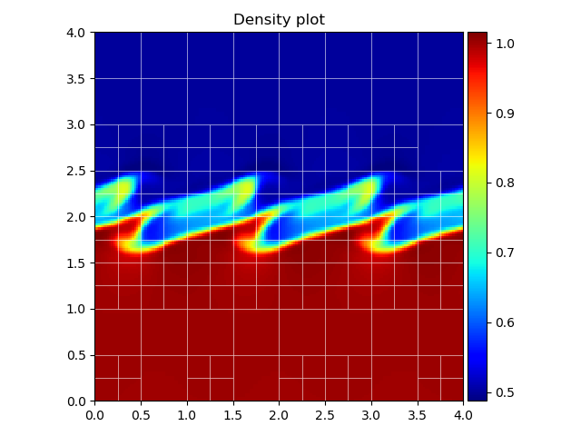

# Reading the dat files

[TOC]

# Introduction on reading datfiles {#introductiondat}

This page provides guidelines and examples to read in and process MPI-AMRVAC `.dat` files with Python.
All required packages and instructions on how to set up the tools folder are described in @ref python_setup.md.
The datfile tools can be found in the folder `$AMRVAC_DIR/tools/python/datfiles`.

# Reading datasets {#reading_dat}

## Obtaining dataset information
All functionality is contained in the file `amrvac_reader.py`, present in the `datfiles/reading` subdirectory.
This class contains various instances and methods linking to other classes and methods in different subdirectories,
keeping usage plain and simple with just one single import.
To import the reader into your script (assuming you installed `amrvac_pytools`):

    import amrvac_pytools as apt

As an example, we will use the file `KH0015.dat`, which is the 2D MHD Cartesian Kelvin-Helmholtz problem from the tests folder.
In order to read in this file, it is sufficient to type

    ds = apt.load_datfile('KH0015.dat')

It is necessary to stress that this command loads the **information** of the `.dat` file, **not** the actual data itself.
This is especially useful to inspect large datasets or time series, without having to load the data into memory every time.
We can inspect this dataset further by using `ds.get_info()`, which prints

    [INFO] Current file      : KH0015.dat
    [INFO] Datfile version   : 4
    [INFO] Current time      : 7.5
    [INFO] Physics type      : mhd
    [INFO] Boundaries        : [0. 0.] -> [4. 4.]
    [INFO] Max AMR level     : 3
    [INFO] Block size        : [12 12]
    [INFO] Number of blocks  : 172
    ----------------------------------------
    Known variables: ['rho', 'm1', 'm2', 'e', 'b1', 'b2', 'v1', 'v2', 'p', 'T']

Note that both the conserved and primitive variables are known and available for data analysis.
The current time of the dataset can be retrieved by `ds.get_time()`, the physical boundaries can be obtained by `ds.get_bounds()`.
The latter returns a list in the form `[[x1, x2], [y1, y2]]`, which will be extended by `x3, y3 and [z1, z2, z3]` for a 3D dataset, with similar reasoning for a 1D dataset.
The method `ds.get_extrema(var)` returns the minimum and maximum value of the required variable `var` in the entire dataset, where `var` is one of the known variables above.

## Working with the data
In order to load the entire dataset into memory, one can use the method

    ad = ds.load_all_data()

Most likely the dataset will contain multiple levels of AMR, such that loading this into one single Numpy array is not trivial. Instead, a regridding is performed to the
finest block level over the grid, and all blocks are regridded to this level using flat interpolation. This operation is parallelised using Pythons `multiprocessing` module,
and will only work in Python 3. The optional argument `nbprocs` specifies the number of processors to use when performing the regridding,
this will default to two less than the number available. The optional argument `regriddir` specifies the directory where to save the regridded data as `.npy` (Numpy) files.
The default directory is `regridded_files`, which will be created in the same folder as the current script if it is not present.
Subsequently, the reader will load this regridded data if the script is executed again.

The data can then be accessed by calling the corresponding name in the `ad` dictionary, for example:

    rho = ad['rho']

or any other of the known variables (see above). This works in 1D, 2D and 3D, however, for large 3D datasets the regridding can take quite some time.

# Plotting datasets {#plotting_dat}
The datfile tools include support for plotting both 1D and 2D datasets, in two variants. The first option is directly plotting the regridded data,
which requires that `ds.load_all_data()` has been called. Plotting is then done via

    ds.rgplot(ad['rho'])

where we passed the Numpy array containing the density as an example.

The second option is much more convenient, as it supports plotting the AMR data directly with an optional mesh overlay. This is done through

    ds.amrplot('rho')

Note the difference here between `rgplot` and `amrplot`, in calling the latter method we simply supply the name of the variable to plot.
Finally, calling `ds.show()` shows all created figures in separate windows.

## Example
The following code snippet produces the figure shown below.

    ds = apt.load_datfile('KH0015.dat')
    p = ds.amrplot('rho', draw_mesh=True, mesh_linewidth=0.5, mesh_color='white',
                   mesh_linestyle='solid', mesh_opacity=0.8)
    p.ax.set_title("Density plot")
    p.fig.tight_layout()
    ds.show()

When assigning the plot to the variable `p`, we can retrieve the matplotlib figure and axis instances by calling `p.fig` and `p.ax`, respectively,
transferring full control of the figure to the user. The colorbar can be retrieved by `p.colorbar`.
Plotting on a logarithmic scale is supported for both `rgplot` and `amrplot`, by supplying the argument `logscale=True`.
As shown below, setting `draw_mesh=True` plots the overlaying AMR mesh. The linewidth, color, linestyle and opacity of the mesh are also specified, and can take in
default `matplotlib` values. The colormap can be chosen by supplying the `cmap` argument, the default is `jet`.

Both `rgplot` and `amrplot` create new `matplotlib` figure and axis instances that are used for plotting. However, both methods accept a figure and axis instance as extra argument,
which will then be used instead. This is useful in for example plotting multiple snapshots on a single figure using subplots, like the example below shows.

    import matplotlib.pyplot as plt
    
    fig, ax = plt.subplots(1, 2, figsize=(10, 6))

    ad = ds.load_all_data()
    p1 = ds.amrplot('rho', fig=fig, ax=ax[0], draw_mesh=True, mesh_color='white', 
                     mesh_opacity=0.4, mesh_linewidth=1)
    p2 = ds.rgplot(ad['p'], fig=fig, ax=ax[1], cmap='Greens')

    p1.colorbar.set_label("density")
    p2.colorbar.set_label("pressure")
    p1.ax.set_title("density plot with mesh overlay")
    p2.ax.set_title("pressure plot")

    fig.tight_layout()
    plt.show()

# Synthetic views {#synthetic_dat}
The python tools also include a ray-tracing algorithm along one of the coordinate axes to create synthetic views. Currently two types are supported, the
first one being a synthetic H-alpha view based on a method described in [Heinzel et al. (2015)](https://www.aanda.org/articles/aa/pdf/2015/07/aa25716-15.pdf "Paper" ).
Basically, based on tables given in said paper the degree of ionisation is calculated using the local pressure and temperatures, from which the opacity can be calculated
and eventually the H-alpha intensity by integrating along the line of sight. The second type is a synthetic view of the Faraday rotation measure, which is only possible for MHD
datasets as it uses the component of the magnetic field parallel to the line of sight. Creating these views can be done as follows:

    ds.halpha(line_of_sight='x')
    ds.faraday(line_of_sight='x')

In this example, the line of sight is taken along the `x`-axis, which is the default value. The colormap can be specified using the `cmap` keyword argument, plotting on a
logarithmic scale is done by supplying `logscale=True`. Additionally, just like before, the matplotlib figure, axis and colorbar instances can be obtained by calling for
example `Ha = ds.halpha()`, followed by `Ha.fig`, `Ha.ax` or `Ha.colorbar`.

Please note that the creation of these synthetic views can take some time for large 3D datasets with multiple levels of AMR, as the routines have to integrate each block and merge
the results into one single image.
As a final comment, it is **important** that the units are correctly specified to ensure a consistent calculation of the synthetic views, see [Units](#dat_units) below.

# Units {#dat_units}
Everything described above (except for the synthetic views) is calculated using _normalised code units_. In order to retrieve the correct physical values of the variables
in the dataset, it is important (and good practice) to correctly define the unit normalisations.
The default unit system is `cgs`, which can be switched to `si` via  

    ds.units.cgs=False

If `cgs` units are required, this can be omitted. Setting the normalisations is quite straightforward, and is done through

    ds.units.set_units(unit_length=1.0e9, unit_numberdensity=1.0e9, unit_temperature=1.0e6)

using for example typical solar values in cgs. The `unit_length` and `unit_numberdensity` must always be specified, the third argument can either be `unit_temperature` or
`unit_velocity`. The code then automagically calculates all other normalisations, which can be accessed through

    ds.units.unit_length
    ds.units.unit_numberdensity
    ds.units.unit_temperature
    ds.units.unit_density
    ds.units.unit_magneticfield
    ds.units.unit_time

and so on. Some astrophysical constants are also included, accessible in a similar manner by doing `ds.units.m_p`, which retrieves the proton mass in either cgs or si units,
depending on the unit system used. Known constants are `R`, `m_e`, `m_p`, `k_B`, `ec`, `c` and `Rsun` for the gas constant, electron and proton mass, Boltzmann constant, electric
charge, speed of light and solar radius, respectively.
Converting a variable back to physical units can then be done using

    pressure = ad['p'] * ds.units.unit_pressure
    current_time = ds.get_time() * ds.units.unit_time

and so on. If no unit normalisations are specified, the default values of MPI-AMRVAC will be used.
