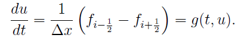
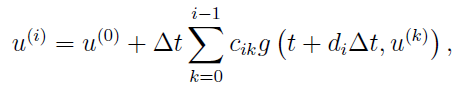
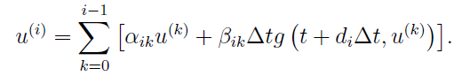
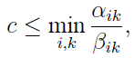
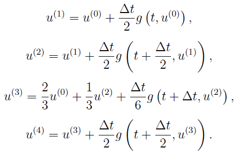

# Time Discretization

[TOC]

Numerical methods for conservation laws can in general be divided into two approaches: a one-step approach, where time and space discretization is coupled and semi-discrete schemes, where time and space integration are separated. AMRVAC chooses to use the latter approach, and provides multiple time discretization methods. They can all be found in mod_advance.t. Please not that not all the schemes could be combined with provided time discretizaiton methods.

If we write a conservation equation into the semi-discrete form, like,

Then, PDE becomes ODE, and if we discrete into: 

We will have,

This is the famous one-step Forward Euler method, and called **onestep** in AMRVAC.

In this method, deltax is decided by the mesh, while deltat is constrained by the CFL condition:

S_max is the maximum wave velocity at the current moment and the small c is called CFL number, and the one-step Euler method requires the CFL number to be between 0 and 1.
As a user, we want the CFL number to be as large as possible, namely, 1.
However, since the maximum velocity estimated in AMRVAC would be lower than the actual value, so that the CFL number should be put only to 0.8 or 0.9 in real simulations, usually.
But in the following discriptions, we will still use the theoretic value, namely, 1.

Then, since most of the spatial discretization in AMRVAC are second-order, we need at least a second-order temporal discretization. Two method provided in AMRVAC is the famous midpoint method (**time_stepper='twostep'** and **time_integrator='Predictor_Corrector'**):

and the Heun's (**time_integrator='ssprk2'**) method:

Actually, they are equivalent to the Midpoint Riemann sum and Trapezoidel rule in numerical integral methods, respectively.

Then, in AMRVAC, we have higher order time discretization methods.
But before introducing them, we should know that either first-order or second-order methods can be recognised as first-order or second-order Runge-Kutta method, respectively. And to be more generally, we can get *m*-th order RK method:

where

This is the form you can usually see in text books. However, in more recent literatures, this equation will be rewriten in another equivalent form:

For example, the classic RK4 written in this form would be:

This is exactly what we call **rk4** in AMRVAC.

Besides **rk4**, AMRVAC also provide other fourth-order RK methods, namely, **jameson** (variant by Antony Jameson). They are simpler than the classic one, for example, the Jameson variant is:

Due to their simplicity, they are used by some other codes like MURaM instead of classic RK4.

As we know, with different combination of coefficients, we can have as many varients of RK4 as we want.
Then, what is the difference between these methods?
Actually, these methods can perform similarly in linear problems.
However, in non-linear problems, the classic RK4 performs to be a true fourth-order method.

Nevertheless, even the classic RK4 suffers from some drawbacks, namely, it cannot fulfill the TVD condition.
As we know, most TVD schemes are derived with one-step Euler method.
In the spatial discretization, first-order upwind scheme can always fulfill the TVD condition, but higher-order schemes may not.
Similarly, the one-step Euler method can always fulfill the TVD condition, but higher-order RK methods may not.
Thus, we shall also pursue a methond that fulfill the TVD condition for higher-order RK methods, especially when using a TVD scheme.
Actually, for a RK method, if all the coefficients alpha_{ik} and beta_{ik} are not negative, if the CFL number can fulfill:

This RK method would fulfill the TVD condition.
AMRVAC provides the third-order TVD RK method(**time_stepper='threestep'** and **time_integrator='ssprk3'**):

This third-order RK method, a.k.a. Shu-Osher method, can allow the CFL number to be 1, the same with the one-step Euler method.
Therefore, it is favoured by many users.

Several years after the Shu-Osher method is proposed, the research of RK methods moved from TVD condition to the so-called strong stability preserving or SSP condition.
Actually these two concepts are similar, but the SSP might have broader meaning.
Anyway, we will still use the term TVD in the following discriptions.

For the third-order TVD RK method, the CFL number could be as large as 1.
While the cost is three steps. Generally, for an *m*-step *s*-order RK method, there must be m >= s.
So, if we want *m* to be as small as possible, we should have m = s.
However, it is proved that if we want an *s*-step *s*-order RK method to fulfill the TVD conditon, *s* could not be more than 3. Otherwise, the function g(t,u) should be reversible. However, even g(t,u) is reversible, considering that double time cost would be needed, we seldom consider an *s*-step *s*-order RK method with *s* more than 3. At the same time, it is also proved that, the CFL number of an *m*-step *s*-order RK method could not be more than m-s+1, which means that for a four-step third-order RK method, theoretically we can allow the CFL number to be 2, which seems to be cost-effective. The following is this four-step third-order RK method in AMRVAC, or **time_stepper='fourstep'** with **time_integrator='ssprk4'**:

But note that this upper limit m-s+1 could not be met by most RK methods, for example, for the five-step fourth-order RK method, the CFL number could only be 1.508 instead of 2. Anyway, even with 1.508, the effective CFL number (means CFL per step) is larger than Shu-Osher method. Therefore, this **fivestep** with **ssprk5** method is also favoured by many users. But since the coefficients of **ssprk5** are too long to present here, the users are recommended to see the Appendix B in Spiteri et al. 2002 or Section 2.1 in Gottlieb 2005 for details (but actually, the coefficients in these two papers are not exactly the same...) .

***IMEX SCHEMES***

Various IMEX flavors are available.
When another imex scheme is implemented (in mod\_advance.t) use\_imex\_scheme flag should  also be set to .true.  in amrvacio/mod\_input\_output.t
This is used by the physics modules which usually use IMEX schemes (and have both explicit and implicit implementations, such is the case of rd and twofl physics modules).

