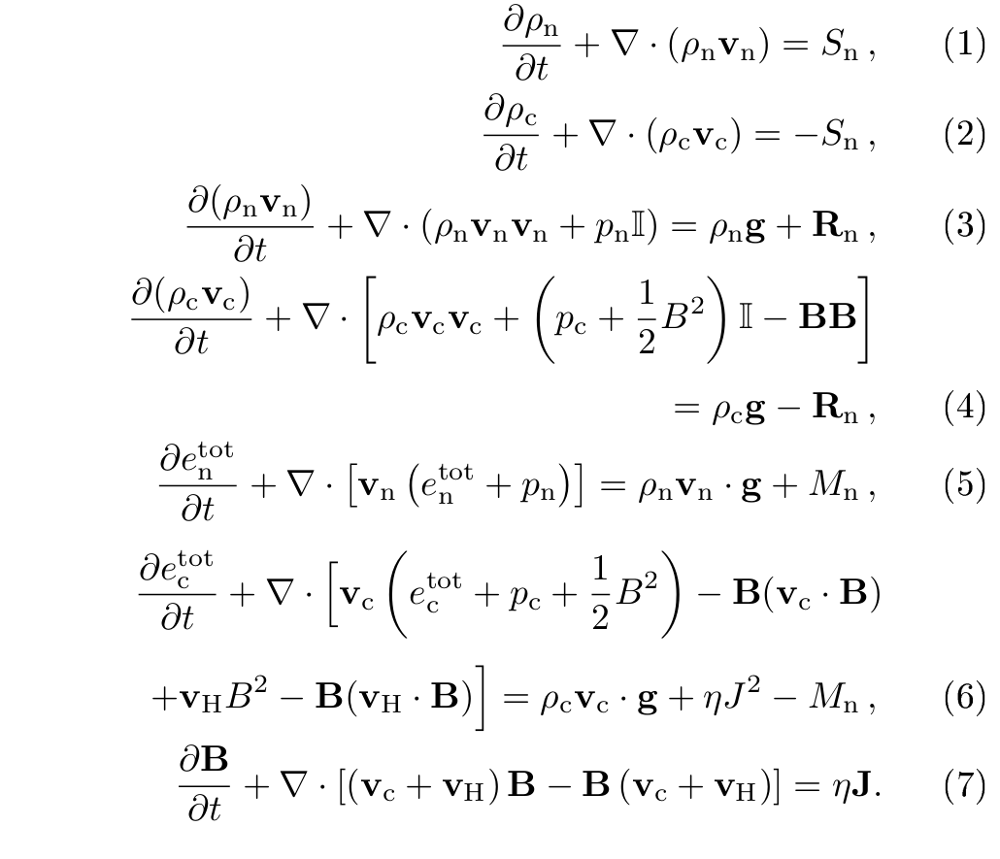

# Two fluid equations 

##The collisonal terms


##Preprocessor directives variables defined in **amrvac.h**

    ONE_FLUID
In order to use the two fluid module as MHD (remove neutral related and possibility to add ambipolar diffusion) set explicitly ONE\_FLUID=1 in the h file
In the ONE\_FLUID case it is possible to set the ionizations fractions of H and He which imply a change in the units compared to the MHD module where H and He are fully ionized.

##Parameters set in **twofl\_list**

```
    namelist /twofl_list/ twofl_eq_energy, twofl_gamma, twofl_adiab,&
      twofl_eta, twofl_eta_hyper, twofl_etah, twofl_glm_alpha,&
      twofl_thermal_conduction_c, use_twofl_tc_c, twofl_radiative_cooling_c, twofl_Hall, twofl_gravity,&
      twofl_viscosity, twofl_4th_order, typedivbfix, source_split_divb, divbdiff,&
      typedivbdiff, type_ct, divbwave, SI_unit, B0field,&
      B0field_forcefree, Bdip, Bquad, Boct, Busr,twofl_equi_thermal_c,&
      !added:
      twofl_dump_full_vars, has_equi_rho_c0, has_equi_pe_c0, twofl_hyperdiffusivity,twofl_dump_hyperdiffusivity_coef,&
#if !defined(ONE_FLUID) || ONE_FLUID==0
      has_equi_pe_n0, has_equi_rho_n0, twofl_thermal_conduction_n, twofl_radiative_cooling_n,  &
      twofl_alpha_coll,twofl_alpha_coll_constant,twofl_implicit_coll_terms,&
      twofl_coll_inc_te, twofl_coll_inc_ionrec,twofl_equi_thermal,twofl_equi_thermal_n,dtcollpar,&
      twofl_dump_coll_terms,twofl_implicit_calc_mult_method,&
#else
      twofl_ambipolar, twofl_ambipolar_sts, twofl_eta_ambi,&
      H_ion_fr, He_ion_fr, He_abundance, He_ion_fr2,&
#endif
      boundary_divbfix, boundary_divbfix_skip, twofl_divb_4thorder, &
      twofl_boris_method, twofl_boris_c, clean_initial_divb,  &
      twofl_trac, twofl_trac_type, twofl_trac_mask,twofl_cbounds_species
``` 


# Splitting

set 
```
has_equi_pe_n0
has_equi_pe_c0
has_equi_rho_n0
has_equi_rho_c0
```
to true in ***twofl\_list***
and implement usr\_set\_equi\_vars in mod\_ust.t file


```
  subroutine usr_init()

  ...

    usr_set_equi_vars => special_set_equi_vars
  
  ...
  end subroutine usr_init


  subroutine special_set_equi_vars(ixI^L,ixO^L,x,w0)
    use mod_global_parameters
    integer, intent(in)             :: ixI^L,ixO^L
    double precision, intent(in)    :: x(ixI^S,1:ndim)
    double precision, intent(inout) :: w0(ixI^S,1:number_equi_vars)
    double precision, allocatable, dimension(:) :: rho_n0, rho_c0, pe_n0, pe_c0
    integer :: ix2

    allocate(rho_n0(ixOmin1:ixOmax1), pe_n0(ixOmin1:ixOmax1), rho_c0(ixOmin1:ixOmax1), pe_c0(ixOmin1:ixOmax1))

    call set_equi_vars2(x(ixOmin1:ixOmax1,ixOmin2,1), pe_n0(ixOmin1:ixOmax1), pe_c0(ixOmin1:ixOmax1), &
                        rho_n0(ixOmin1:ixOmax1), rho_c0(ixOmin1:ixOmax1))
    do ix2=ixOmin2,ixOmax2
      w0(ixOmin1:ixOmax1,ix2,equi_pe_c0_) = pe_c0(ixOmin1:ixOmax1)
      w0(ixOmin1:ixOmax1,ix2,equi_rho_c0_) = rho_c0(ixOmin1:ixOmax1)
      w0(ixOmin1:ixOmax1,ix2,equi_pe_n0_) = pe_n0(ixOmin1:ixOmax1)
      w0(ixOmin1:ixOmax1,ix2,equi_rho_n0_) = rho_n0(ixOmin1:ixOmax1)
    enddo
    deallocate(rho_n0,pe_n0,rho_c0,pe_c0)


  end subroutine special_set_equi_vars

```


# Hyperdiffusivity
# Convert


The two fluid module uses the conversion to dat files.  A new type of conversion has been defined "dat_generic_mpi"
which has to be set in **filelist** in the parameter file:
    convert_type="dat_generic_mpi"
and (convert or autoconvert). 
The code below is from twofl\_check\_params subroutine in twofl/mod\_twofl\_phys.t:

```
        if(twofl_dump_full_vars) then
          if(mype .eq. 0) print*, " add conversion method: split -> full "
          call add_convert_method(convert_vars_splitting, nw, cons_wnames, "new")
        endif
#if !defined(ONE_FLUID) || ONE_FLUID==0
        if(twofl_dump_coll_terms) then
          if(mype .eq. 0) print*, " add conversion method: dump coll terms "
          call add_convert_method(dump_coll_terms, 3, (/"alpha    ", "gamma_rec", "gamma_ion"/), "_coll")
        endif
#endif

```

```
  function dump_coll_terms(ixI^L,ixO^L, w, x, nwc) result(wnew)
   use mod_global_parameters
   integer, intent(in)             :: ixI^L,ixO^L, nwc
   double precision, intent(in)    :: w(ixI^S, 1:nw)
   double precision, intent(in)    :: x(ixI^S,1:ndim)
   double precision   :: wnew(ixO^S, 1:nwc)

   call get_alpha_coll(ixI^L, ixO^L, w, x, wnew(ixI^S,1))
   call get_gamma_ion_rec(ixI^L, ixO^L, w, x, wnew(ixI^S,2), wnew(ixI^S,3))
  end function dump_coll_terms

```

In the user file mod\_usr.t add\_convert\_method  could be called in the usr\_init subroutine.

##Changes

* src 
  - vacpp.pl 
   * Don't break OpenMP, **std preprocessor directives (lines starting with '#')**, print and //&
  - amr\_solution\_node.t
    * equi\_vars (**defined in**  mod\_physicaldata.t) allocated for state
    * states for imex rk4 (-> changes in mod\_advance.t)
  - amrvacio/convert.t
    * convert\_type dat\_generic\_mpi  
    * phys\_te\_images
  - amrvacio/mod\_input\_output.t
    * changed nghostcells=3 for nghostcells=max(nghostcells,3)  
    because the physics module might initialize directly nghostcells for ghost consuming operation
    which is not done additionally to the limiter 
  - mod\_finite\_difference.t
     fd uses centered values in phys_get_flux -> b0i has to be set to 0
     and it was set to idim 
  - physics/mod\_physics.t
    * added phys\_gamma and subroutines phys\_set\_equi\_vars  (implemented in the twofl module)
      and temporarily? phys\_te\_images 
    *  TODO remove phys\_get\_v\_idim  because it is not called anywhere  
  - hd, mhd modules: 
      * rad cooling; th cond; th em;
  - all physics modules (and mod\_finite\_{difference,volume} ):
      * cmax, cmin extra dimension for the specie number
  - mod\_finite\_volume.t
      * changed get_Riemann_flux_hll for  get_Riemann_flux_hll_species,...
  - mod\_variables.t 
      * added number\_species, index\_v\_mag, iw\_rho\_equi used in HLLD solver -> 
       hlld solver (in mod\_finite\_volume.t)  to use splitting and for multiple species
       hlld is used for index\_v_\mag species and hllc for others.
  - added phys\_hllc\_init\_species in physics/mod\_physics\_hllc.t to use it for different species (sets the indices).
  - MHD module: temporarily added explicit USE\_SPLIT\_B0=0  in h file to test speed up for non-split mag field
  - temporarily added bcexch in mod\_ghostcells\_update.t similarly to bcphys to test speedup on IMEX schemes
  - TODO: delete RM\_W0 from preproc directives, hllc and splitting 
  - TODO is it necessary?
```
diff -r amrvac/src/mod_space_filling_curve.t amrvac-orig/src/mod_space_filling_curve.t
45,46c45,46
<     if(.not. allocated(iglevel1_sfc)) allocate(iglevel1_sfc(ng^D(1)))
<     if(.not. allocated(sfc_iglevel1)) allocate(sfc_iglevel1(ndim,nglev1))
---
>     allocate(iglevel1_sfc(ng^D(1)))
>     allocate(sfc_iglevel1(ndim,nglev1))

```
* arch
  - amrvac.make 
   * Copy the header (amrvac.h is a user file) in the lib folder. 
  **This changes should be done in the user makefile.**
```
diff -r amrvac/arch/amrvac.make amrvac-orig/arch/amrvac.make
20a21
> .PHONY: all clean allclean force
22,33c23
< 
< .PHONY: all clean allclean force hdr
< 
< all: hdr amrvac
< 
< # copy amrvac.h (in order to use the std preprocessor in the main code files, e.g. twofl); create the file if it does not exist
< hdr:
< ifeq ("$(wildcard amrvac.h)","")
<   touch amrvac.h
< endif
<   @mkdir -p $(LIB_DIR)  # Prevent error message
<   rsync -c amrvac.h $(LIB_DIR)/amrvac.h
---
> all: amrvac

```
  - rules.make
    * add the header for the compilation
  - {default,debug}.defs added flag for preprocessor. TODO: add flag for intel compiler.


