# AMRVAC datasets and YT

[TOC]

# Introduction {#yt_introduction}

The release of AMRVAC 2.2 included minor changes in the datfile format, in order to improve compatibility with [`yt`](https://yt-project.org), an open-source Python package for analysing and visualising volumetric data. `yt` supports AMR meshes and can handle discrete or sampled data such as particles. It's query-based so that it can handle larger-than-RAM datasets and makes uses of [Cython](https://cython.org) for speed-up and C-interoperability.

The main goal of this webpage is to show off some of yt's functionality and possibilities. For a detailed guide explaining the full capabilities of `yt` (with examples!), we refer to [The YT Cookbook](https://yt-project.org/doc/cookbook/index.html).

The `yt` frontend for AMRVAC was developed by Clément Robert and Niels Claes (who are also the current maintainers). The actual pull request for the frontend, including it in the main `yt` repository, was accepted on the 13th of November, 2019.

Because the frontend is brand new (and hence currently in beta), we would greatly appreciate any feedback or issues that you encounter.
The most efficient ways to get in touch with us are either
- [reporting issues on github](https://github.com/yt-project/yt/issues)
- [joining yt's Slackspace](https://yt-project.org/doc/help/index.html#go-on-slack-or-irc-to-ask-a-question) (join channels help and amrvac)

## Installing yt {#yt_installation}

The [yt website](https://yt-project.org) has detailed instructions on how to install the `yt` package. As of right now the only way to use the AMRVAC frontend is building [from source](https://yt-project.org/doc/installing.html#installing-yt-from-source).
It's recommended to use `-e` as well, so you can immediately pull updates from the repository. Required dependencies are `Numpy` and `Cython`.

    pip install numpy cython
    git clone https://github.com/yt-project/yt
    cd yt
    git checkout master
    pip install -e .

## Current limitations & unsupported features {#limitations}

- If dust fields are present (e.g. rhod1, md1...) they will be detected by `yt` but no units are currently attached to them.
- `yt` supports particle data, but this has not (yet) been implemented in the AMRVAC frontend. This might come later.
- Staggered grids (version 2.2 and later): `yt` will log a warning if staggered grids are loaded, but the flag is currently ignored. You can still use all of `yt`'s features on those datasets though.
- Stretched grids (as defined in AMRVAC) have (for the moment) no correspondence in `yt` and are not supported.

## Loading datasets {#loading_datasets}

Before loading datasets, we obviously have to import the `yt` package:

    import yt

After this, loading an MPI-AMRVAC datafile is as easy as doing

    ds = yt.load('KH_2d0016.dat')

    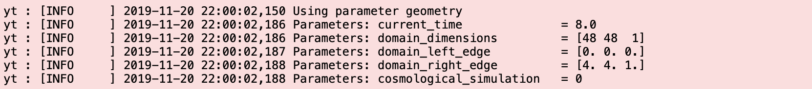

### Additional arguments when loading

From datfile version 5 onwards a geometry flag was added to the header, which is used by `yt` to set the geometry. Older versions of the datfiles do not have this flag, in that case it should be added manually by supplying the `override_geometry` parameter ('`cylindrical`', '`polar`', '`spherical`' or '`cartesian`'). The default is '`cartesian`'.

AMRVAC always uses dimensionless quantities, `yt` however re-dimensionalises everything to `cgs` by default unless specified otherwise. Choosing which units are displayed can be done by supplying the parameter `unit_system` ('`cgs`', '`mks`' or '`code`') when loading, like this

    ds = yt.load('KH_2d0016.dat', unit_system='mks')

    

As no unit system is ever attached to the datfile itself overrides have to be provided by the user if normalisations were specified in the `mod_usr.t` file. This is done through the parameter `units_override`. More information can be found [on the website](https://yt-project.org/docs/dev/examining/loading_data.html), an example is given below.

    overrides = dict(length_unit=(1e9, 'cm'), temperature_unit=(1e6, 'K'))
    ds = yt.load('KH_2d0016.dat', units_override=overrides)

    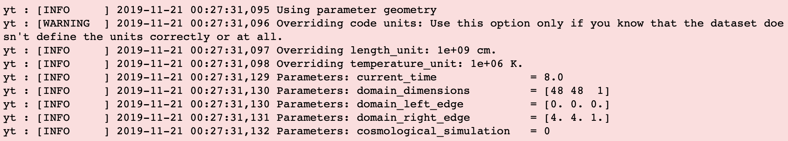

For this small demo we will be using one of the datasets from the 3D Cartesian blastwave found in the MHD tests folder, done with version 2.2 of the code. Note that `yt` can actually handle older versions of the datfiles as well. As can be seen below an info message is printed to the console stating that the geometry parameter has been found. For older versions this will be a warning instead, notifying the user that no geometry flag was found and 'Cartesian' is used as a default. The parameter `geometry_override` always has to be used for geometries other than Cartesian in older datfile versions. The warning will disappear starting from datfile version 5 onwards.

The blastwave simulation was done using the constrained transport method `ct` to fix the divB condition. `yt` will log a warning saying that the `staggered` flag is found, but for the moment that flag is ignored.

    ds = yt.load('blastwave_3d_cart0003.dat')

    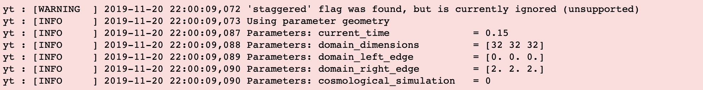

Note that `yt` prints information about the dataset when loading, such as the time and domain edges of the current snapshot (in code units). When loading multiple files it may be convenient to reduce or even turn off the info and/or warning messages. Doing this is very straightforward, and more information about that can be found [here](https://yt-project.org/doc/faq/index.html#how-can-i-change-yt-s-log-level).
Some additional information about the dataset can be retrieved through

    ds.print_stats()

    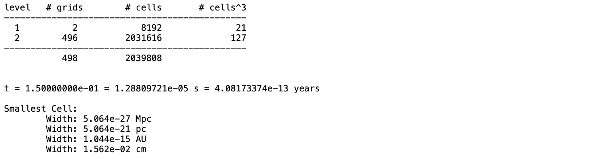

# Creating slices, and much more {#slices}

`yt` can easily create slices of 3D datasets. Here a slice parallel to one of the coordinate axes is shown, but slices can be created using an arbitrary angle. For a tutorial on how to do this we refer to the [documentation](https://yt-project.org/docs/dev/visualizing/plots.html#off-axis-slices).

    # create a slice parallel to the yz-plane, in the middle of the x-range
    p = yt.SlicePlot(ds, 'x', "density")
    p.set_log('density', False)

    # Draw a velocity vector every 30 pixels.
    p.annotate_velocity(factor = 30)

    # overplot density contours
    p.annotate_contour("density", ncont=5, label=False, plot_args={"colors": "red", "linewidths": 2})

    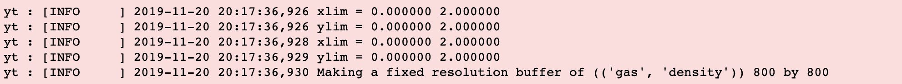

    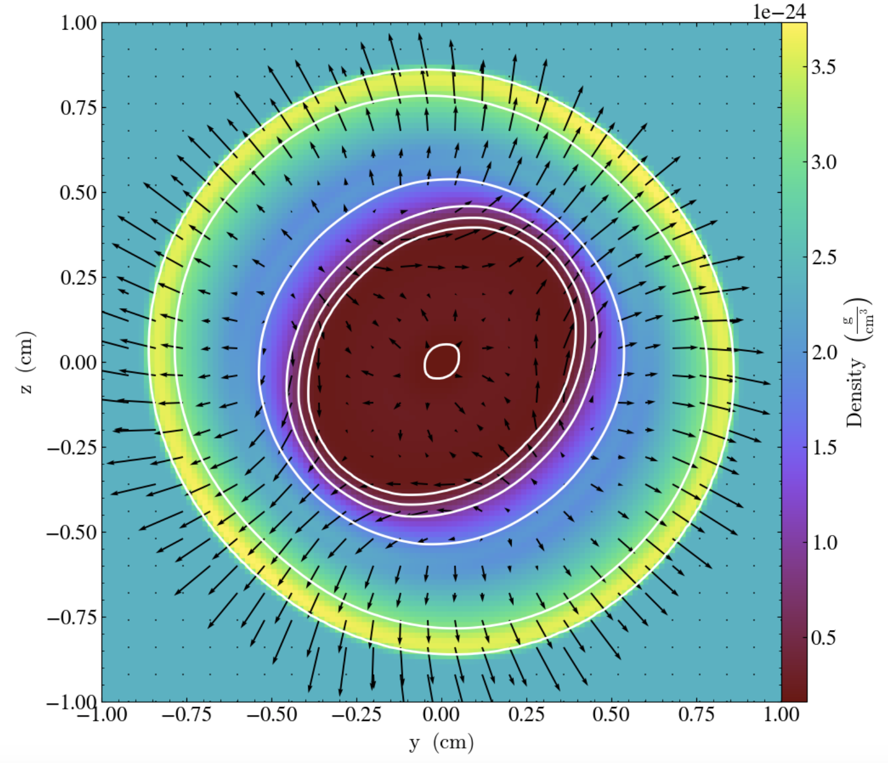

## An example of the 'much more' {#slicesmore}

For those of you that are always struggling with decently drawing magnetic field lines or streamlines, `yt` has a very nice feature for this based on the method of Line Integral Convolution (LIC). More information can be found in the `yt` docs and in [this blog](https://blog.yt-project.org/post/LineIntegralConvolution/), but we've given an example below.

    p2 = yt.SlicePlot(ds, 'x', 'density')
    p2.set_log('density', False)
    p2.annotate_line_integral_convolution('velocity_y', 'velocity_z', lim=(0.4, 0.7))

    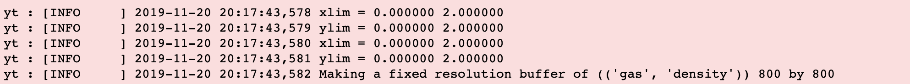

    

# Isocontours exactly how you want them {#isocontours}

The example below shows how to create an isocontour of one of the fields, in this case the density. For a detailed guide see [the documentation](https://yt-project.org/doc/cookbook/complex_plots.html#plotting-isocontours-and-streamlines).

    import numpy as np
    import matplotlib.pylab as pl
    from mpl_toolkits.mplot3d import Axes3D
    from mpl_toolkits.mplot3d.art3d import Poly3DCollection

    # Create a sphere centered around the smallest density point, radius 0.5 code lengths
    sphere = ds.sphere("min", (0.5, "code_length"))

    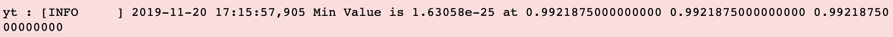

    # isodensity surface in this sphere
    surface = ds.surface(sphere, "density", 1e-24)
    colors = yt.apply_colormap(np.log10(surface["density"]), cmap_name="Greys")

    

    p3dc = Poly3DCollection(surface.triangles, linewidth=0.0)

    # Set the surface colors in the right scaling [0,1]
    p3dc.set_facecolors(colors[0,:,:]/255.)

    fig = pl.figure()
    ax = fig.gca(projection='3d')
    ax.add_collection(p3dc)
    ax.auto_scale_xyz([0.5, 1.5], [0.5, 1.5], [0.5, 1.5])

    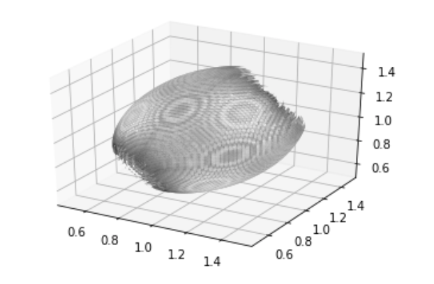

For larger datasets this process is very slow as soon as `Poly3DCollection` is called. `Matplotlib` is great for 2D plotting, but really lacks performance to render high-resolution 3D datasets in real time. However, the isocontours calculated here (`surface` above) can be easily exported to [obj format](https://en.wikipedia.org/wiki/Wavefront_.obj_file), such that it can be imported straight away in applications like [Blender](https://www.blender.org) or [SketchFab](https://sketchfab.com), specifically tailored for these kind of problems. This allows you interact with renderings, create beautiful animations of your data and much more. The [yt docs](https://yt-project.org/docs/dev/visualizing/sketchfab.html#surfaces) have some nice example scripts and demos.

# Maybe a volume rendering too? {#volume_rendering}

In the example below we create a simple volume rendering of the 3D blastwave dataset. The user has full control over the camera position, fields to render, transfer function and more. Detailed guides can be found [here](https://yt-project.org/docs/dev/visualizing/volume_rendering.html#volume-rendering).

    sc = yt.create_scene(ds, lens_type='perspective')

    source = sc[0]
    source.set_field('density')
    source.set_log(True)

    # Camera properties
    sc.camera.focus = ds.domain_center
    sc.camera.position = [1.5, 1, 1.5]  # coordinates of the camera

    # additional features
    sc.annotate_axes(alpha = 1)                   # plot axes system as well
    sc.annotate_domain(ds, color=[1, 1, 1, 0.5])  # draws box in colors [R, G, B, alpha]

    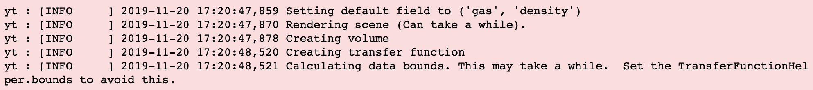

    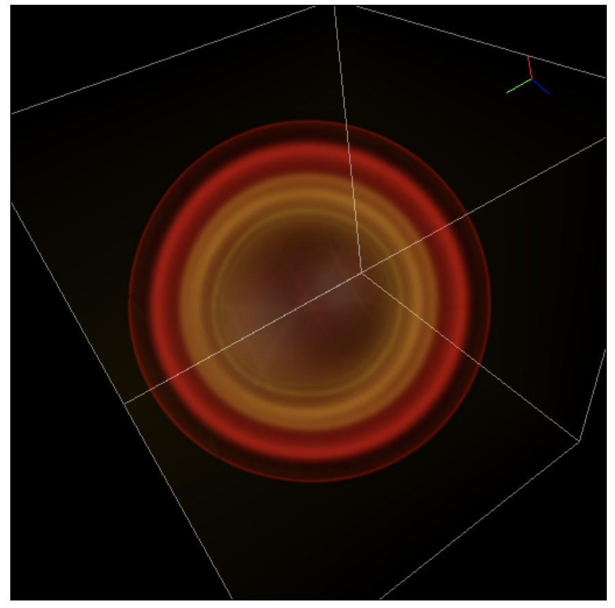

# Loading a dataset with a different geometry

As mentioned above, `yt` can handle multiple geometries. Here we show how to load in a spherical dataset from amrvac 2.1, such that the geometry flag is not present in the datfile. Note that `yt` _explicitly_ warns the user that the geometry flag was not found, and that a geometry override was supplied and used. From version 2.2 onwards this is no longer needed, as `yt` automatically sets the geometry using the flag.

It's quite important to mention that `override_geometry` takes priority, _even if the geometry flag is present in the datfile_. This implies that the user can force `r` and `theta` in polar geometries, for example, but this may have undesired consequenses.

    ds2 = yt.load('bw_spherical_3D0003.dat', geometry_override='spherical')

    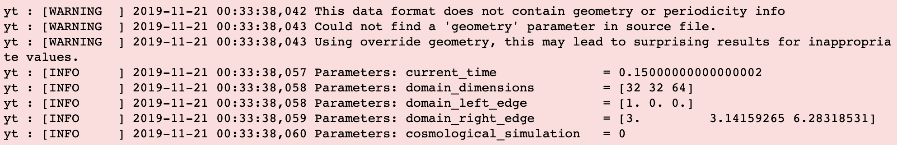

    p = yt.SlicePlot(ds2, 'phi', 'density')
    p.set_log('density', False)

    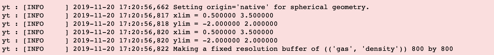

    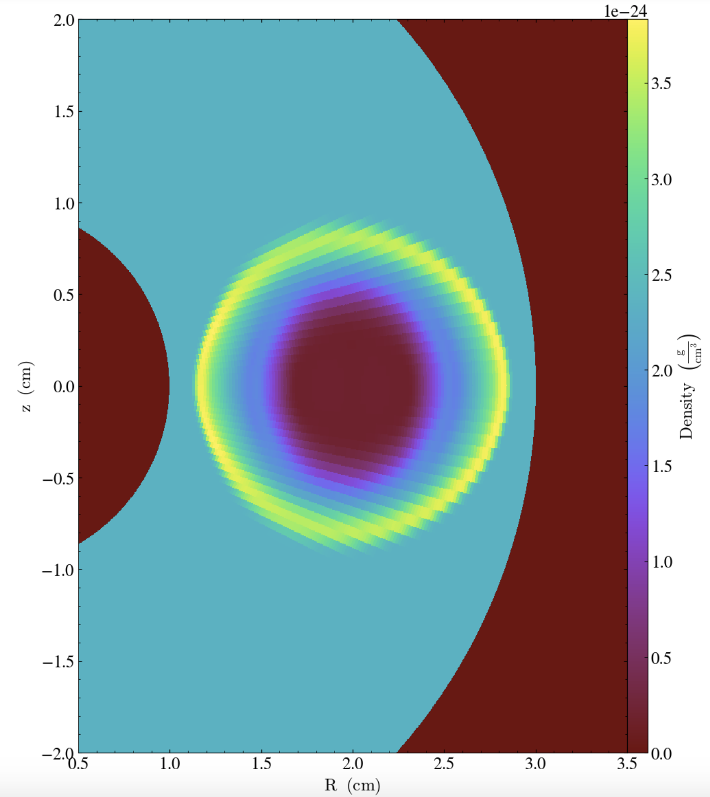

# Defining your own fields {#custom_fields}

`yt` knows some basic and derived fields, but it's perfectly possible to define one (or more) yourself in a very straightforward way. Again, there are a lot of code snippets in [the docs](https://yt-project.org/doc/cookbook/calculating_information.html#simple-derived-fields) on how to do this, a simple example is given here. You can even go one step further, and use previously custom defined fields to create new fields... The possibilities are endless!

    def _velocity_squared(field, data):
        return data['velocity_x']**2 + data['velocity_y']**2 + data['velocity_z']**2

    ds.add_field(("gas", "velocity_squared"), function=_velocity_squared, units='cm**2*s**-2',
        sampling_type='cell')

    p3 = yt.SlicePlot(ds, 'x', 'velocity_squared')
    p3.set_log('velocity_squared', False)
    p3.set_cmap('velocity_squared', 'Blues')

    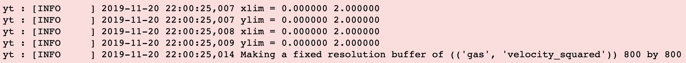

    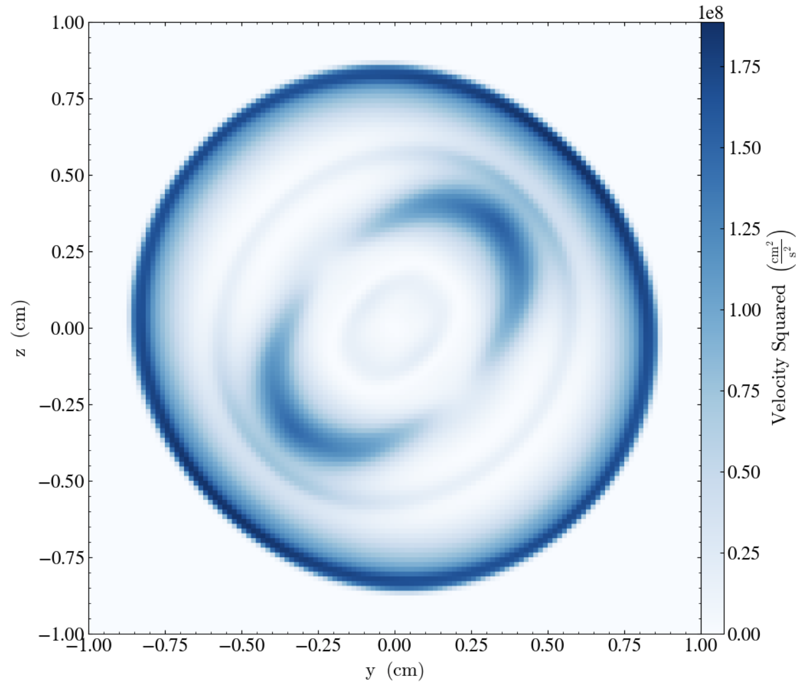

In addition, it is possible to inspect all the fields known by `yt` that are in the datfile, simply through

    print(ds.field_list)

    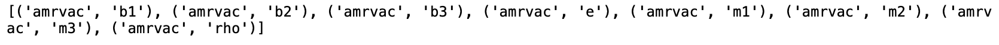

Furthermore, it is also possible to inspect all fields `yt` _thinks_ it knows based on the fields already present in the dataset. This list is quite extended, though, and it also includes all custom-defined fields as well (hence, the field `(gas, velocity_squared)` we just defined will also be present in this list).

    print(ds.derived_field_list)

    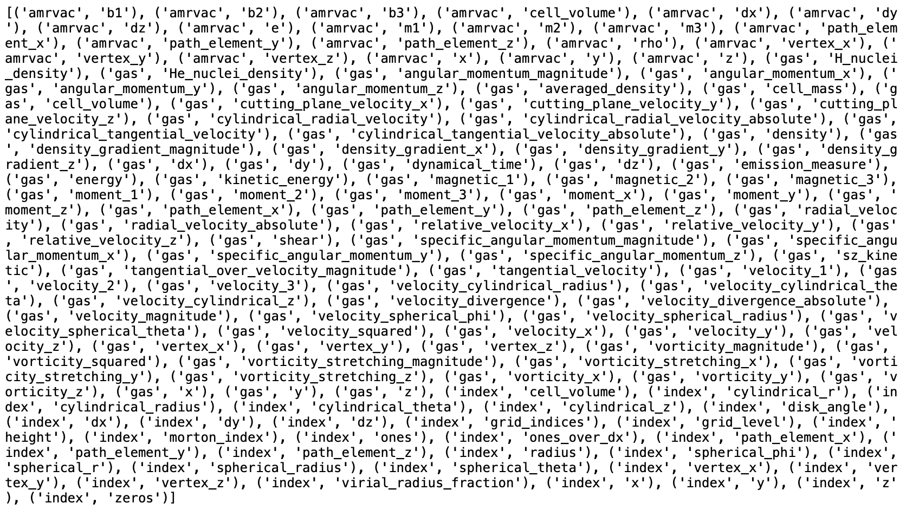

